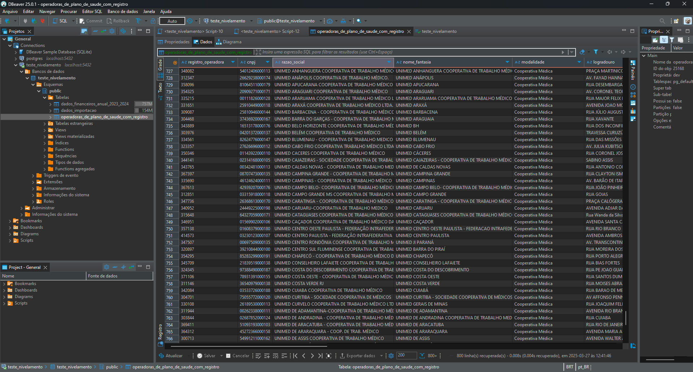
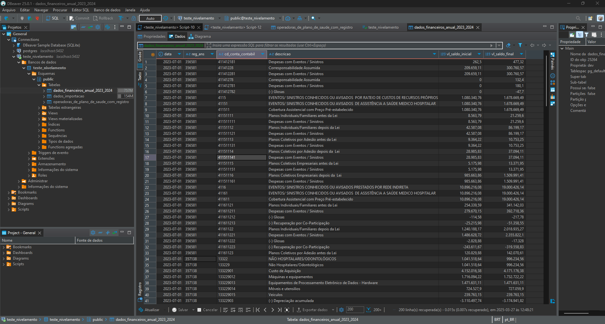
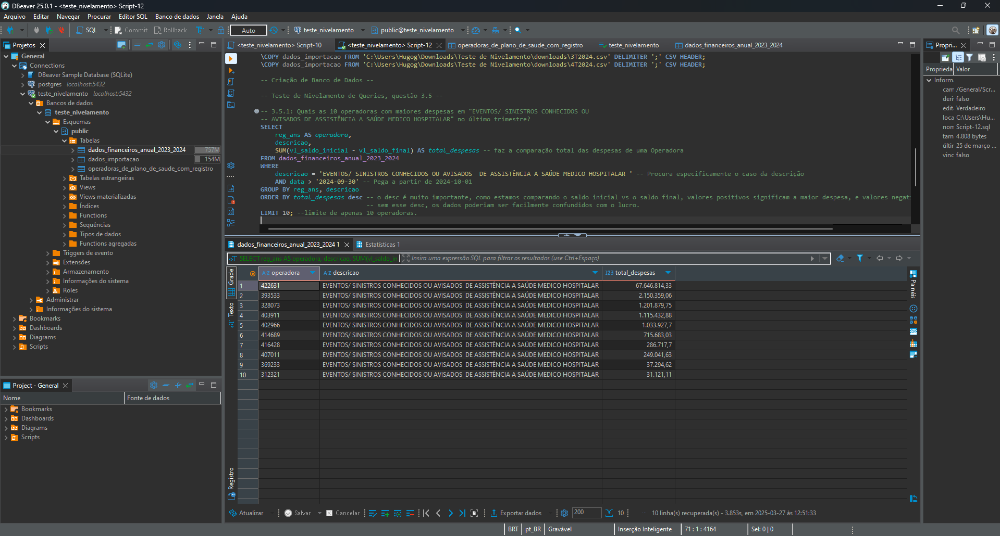
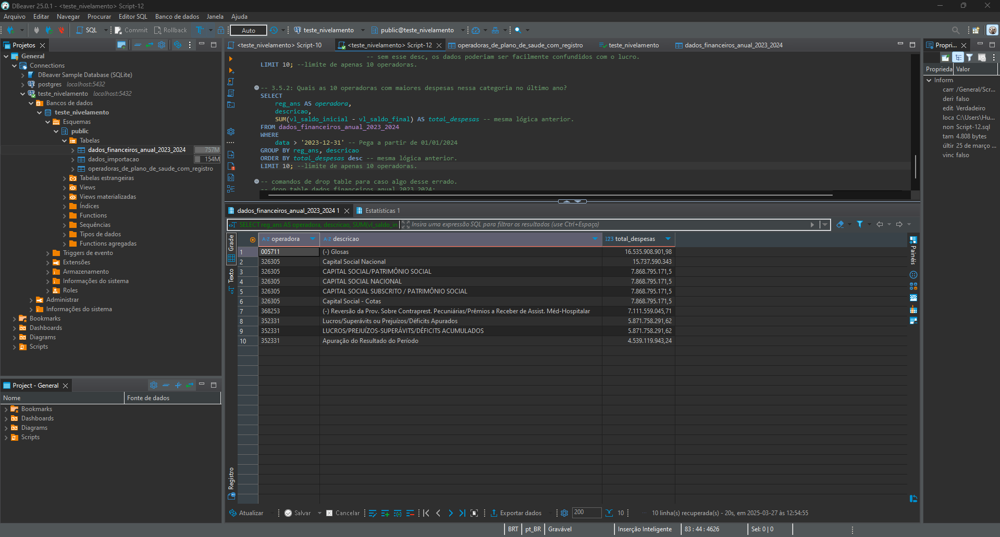

# Olá!
 
 Meu nome é Hugo Gabriel Alves, sou um estudante de programação e engenharia de software, e Seja bem vindo(a) a apresentação do teste de nivelamento da IntuitiveCare. 
 
 Leia este READ.me para descobrir em detalhes como foram feitos todos os exercícios, bem como todas as extensões e como rodar o projeto localmente.

---
### Implementação em Nuvem

Para a criação do Site e da API, foram utilizados o Vercel e o Railway, o Vercel para o front-end da aplicação e o Railway para o back-end e o banco de dados.

 **Acesse o projeto do Teste de nivelamento 4 em:**
 [Relatorios Cadop](https://relatoriosdocadop.vercel.app)

---
### Organização de Pastas
 Todos os testes estão disponíveis em suas Respectivas pastas, cada exercício possui um nome. Sendo eles:

* Teste_1_a_3
  1. *Teste_1.py* <-- Nivelamento 1
  2. *Teste_2.py* <-- Nivelamento 2
  3. *Teste_3_3.sql* <-- Nivelamento 3 (referente a primeira parte dos exercícios)
  4. *Teste_3_4.sql* <-- Nivelamento 3(referente a segunda parte.)

* *Teste_4* <-- Nivelamento 4
  1. *src* <-- Todo o projeto em vue e suas configurações, os arquivos principais de código está no componente ***OperadoraSearch.vue*** para a lógica do front-end do site e a conexão com o banco de dados. 
   
 *server.py* <-- conexão com o banco de dados localmente.

Todos os arquivos estão comentados com as respectivas abordagens e ferramentas utilizadas para completar o nivelamento, bem como a lógica utilizada.

---

### Ferramentas:

Para a conclusão dos testes fornecidos, foram utilizados as seguintes ferramentas e linguagens: 

* Python e SQL
* PostgreSQL (banco de dados escolhido para a realização dos nivelamentos)
* DBeaver (para a conexão e criação de tabelas localmente)
* pgAdmin (Criação do banco de dados na nuvem)
* Vue.js (criação da interface da atividade 4)


---

### Configuração de Imports

As atividades 1 e 2 utilizam as bibliotecas do python e a atividade 4 utiliza as bibliotecas não só do python mas também do npm. sem esses imports adequados, o código não vai funcionar. para configurar o projeto, será necessário:

1. Clonar o repositório com ``` git clone https://github.com/HugoGAFM/Teste_Nivelamento__Intuitive_Care.git```

2. Criar um ambiente Python e depois ativá-lo.
   

   ```
    python -m venv venv
   ```
   ```
    venv\Scripts\activate
   ```


2. Instalar os imports para os Nivelamentos.
   

   ```
    Imports para o Nivelamento 1.
   ```
   ```
    pip install requests
    pip install beautifulSoup4
    pip install zipfile
   ```

   ---

   ```
    Imports para o Nivelamento 2.
   ```
   ```
    pip install pandas
    pip install pdfplumber
    pip install zipfile (não é necessário caso tenha rodado o exercício 1 antes.)
   ```
   ```
    Imports para o Nivelamento 4.
   ```
   ```
    pip install fastapi[all]
    pip install psycopg2
    pip install uvicorn
   ```
   ```
    npm install 
    npm install axios 
   ```

---

### Sobre

Todos os exercícios rodam localmente e foram devidamente testados e corrigidos para erros, só é apenas necessário baixar os Arquivos CSV dos exercícios 3 e importá-los para o banco de dados dentro das tabelas para a conclusão do exercício 4. Fornecerei prints da conexão com banco de dados dando certo e bem como todos os dados importados corretamente. Para a atividade 4, segue um pequeno vídeo meu utilizando a API.

Obs: os arquivos para rodar a aplicação localmente foram mandados no arquivo ZIP no e-mail junto com esse repositório, basta abri-lo e configurar caso queira rodar na maquina local.

- Exercício 3_3: Importação dos dados CADOP
  


- Exercício 3_4: Importação dos dados financeiros 



- Exercício 3_5: Selects do Nivelamento

* **Quais as 10 operadoras com maiores despesas em "EVENTOS/ SINISTROS CONHECIDOS OU
AVISADOS DE ASSISTÊNCIA A SAÚDE MEDICO HOSPITALAR" no último trimestre?** 



* **Quais as 10 operadoras com maiores despesas nessa categoria no último ano?**




**Teste de Nivelamento 4**

* Clique na imagem abaixo para ir diretamente pro vídeo demonstração da API:

  
[](https://www.youtube.com/watch?v=y7MYzVgpN1s)

* *Notas:*
  
  1. foram criados dois caminhos de query do banco de dados, um para o site e o outro para o postman;
  2. No postman, ele pega todos os dados das tabelas da API, já no site, existe uma query mais filtrada e personalizada.


